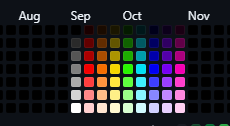

# GitHub Heatmap Colorizer

A Chrome extension that enhances your GitHub contribution calendar by applying a vibrant, customized color scheme to the heatmap.

## Features

- Transforms the standard GitHub contribution heatmap into a colorful visualization
- Uses a custom color palette based on contribution count
- Dynamically updates as you navigate through GitHub
- Lightweight and easy to install

## How It Works

The extension applies a custom color scheme to the GitHub contribution calendar:

- 0-6 contributions: Shades of grey (darker as count increases)
- 7+ contributions: Cycles through a custom hue array with increasing saturation

## Installation

1. Clone this repository or download the source code.
2. Open Chrome and navigate to `chrome://extensions/`.
3. Enable "Developer mode" in the top right corner.
4. Click "Load unpacked" and select the src directory containing the extension files.

## Usage

Once installed, simply navigate to any GitHub profile page. The extension will automatically apply the custom color scheme to the contribution calendar.

## Customization

You can customize the color scheme by modifying the `hueArray` and the `getColor` function in the `content.js` file.

## Contributing

Contributions are welcome! Please feel free to submit a Pull Request.

## License

This project is open source and available under the [MIT License](LICENSE).